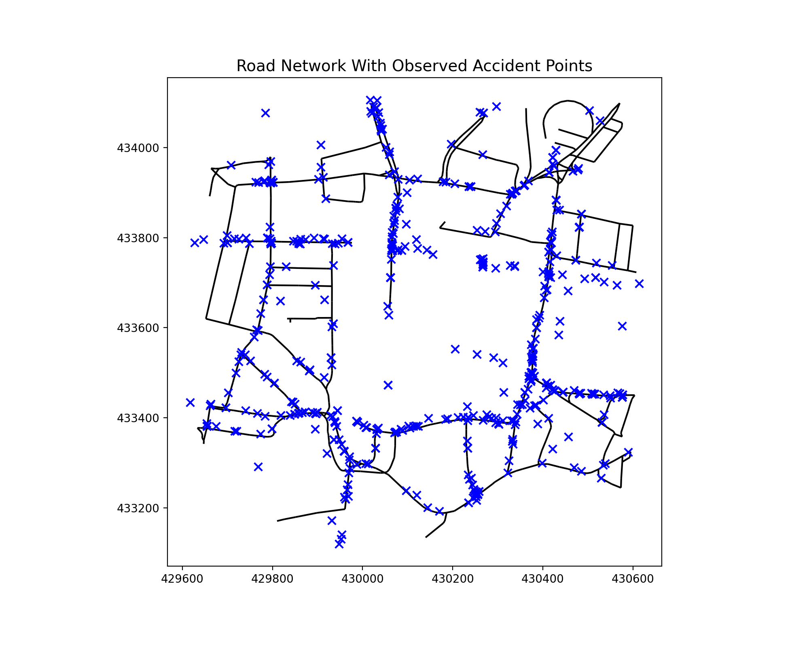
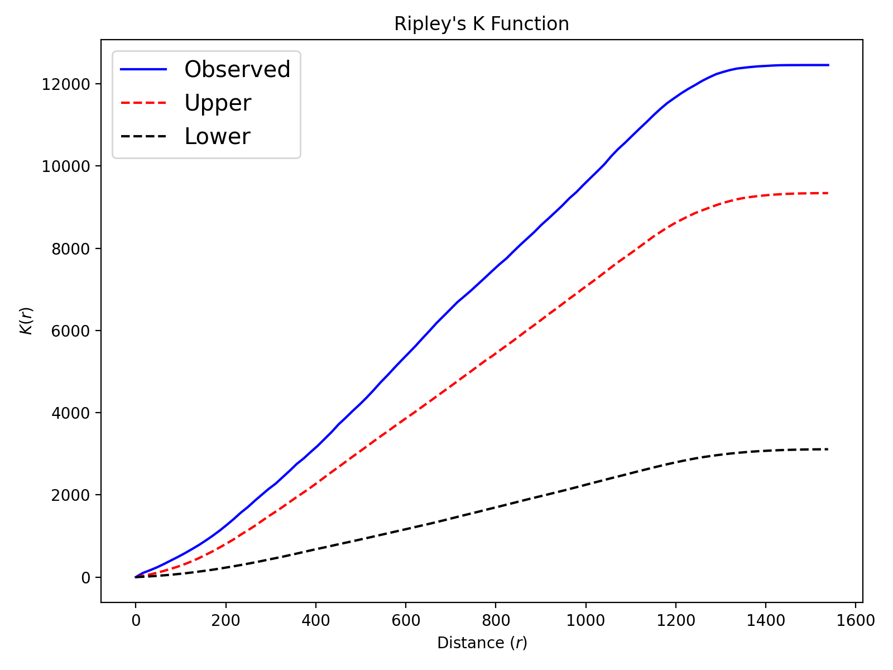

# Network analysis of traffic accidents in Leeds
This is an implementation of network analysis using road traffic accidents dataset in Leeds from 2013 to 2019. A region of $1 km^2$ with more than 500 recorded road accidents is selected from the whole leeds area. Figures below show the road network with ovserved and snapped accident points.
 

Ripley's K function and Moran's I are tested inside this region to comform that the distribution road accidents on the network is not complete spatial randomness and there is high positive spatial autocorrelation in the road accidents. Further more, among many roads, a high number of accidents on one road correlates with a high number of accidents on connecting roads

To investigate where do accidents usually happen along the roads. The distances between each snapped accident point and the nodes of the edges are calculated. The minimum distance is set as the distance between one accident point and the nearest road intersection. The result shows that the mean distance between accident points and road intersections is 29.62 m. And the mean fraction of road length where accidents happened is 0.206, which indicates that accidents usually happened on the straight segments of roads instead of the intersections of roads.